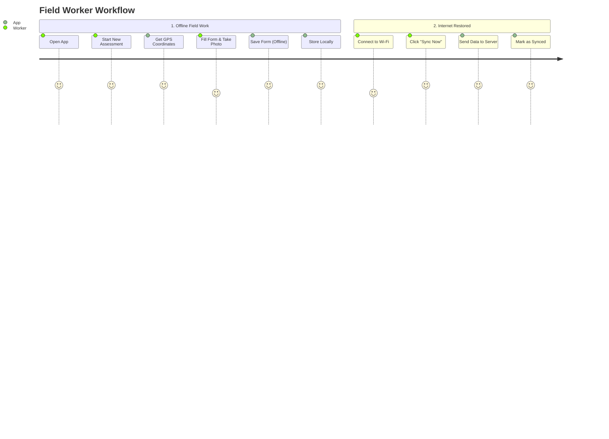
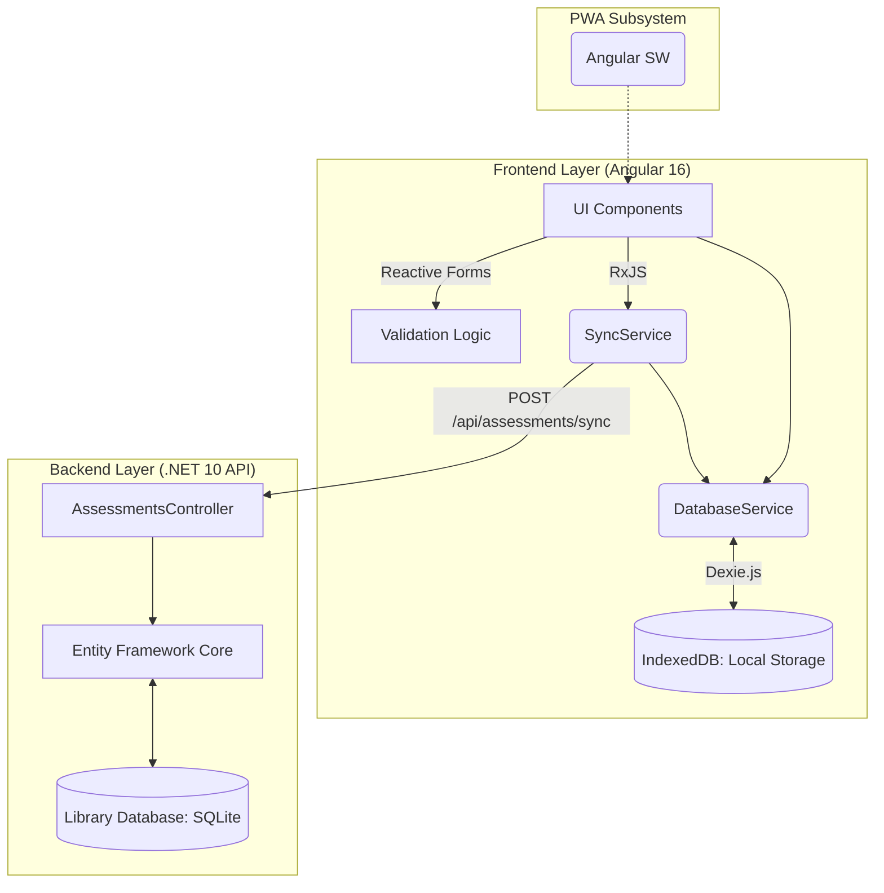

# Field Journal: Flood Damage Assessment PWA

A simple, offline-capable mobile web app for field workers to record flood damage and site details during disaster recovery. 

Built with Angular 16 and a .NET 10 Web API.

---

## Key Features

- **Chicken Count:** Prevents entering negative numbers.
- **Farm Condition:** Selecting "Bad" condition marks the assessment as high-priority.
- **Photos:** Images are saved locally to the device when offline. When internet is restored, they sync to the server.
- **Location:** Uses the device's GPS for coordinates. If GPS is unavailable or denied, it defaults to (0, 0) to allow the assessment to continue.

---

## How It Works



---

## Application Architecture



---

## Setup & Execution Guide

### 1. Backend (.NET 10)
Ensure you have the .NET 10 SDK installed. The application uses Entity Framework Core and an `EnsureCreated()` hook, meaning you do not need to run manual migrations for local development.

```bash
cd Backend/FloodAssessment.Api
dotnet build
dotnet run
```
*The local database `flood_assessments.db` will be created automatically upon the API launching.*

### 2. Frontend (Angular 16)
Ensure Node.js is installed.

```bash
cd Frontend
npm install
npm run start
```
*Note: To simulate the offline-first experience locally, open Chrome DevTools -> Naviate to the "Network" tab -> Change throttling to "Offline". You can then fill out forms, save them to the local IndexedDB, and watch them queue. Turn throttling back to "No throttling" and hit Sync Now to push them to the Web API.*
